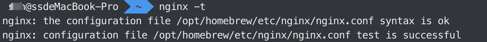

# Nginx

## mac 系统进行 nginx 代理配置

### 一、找到 nginx 配置文件

- nginx -t 可以找到 nginx 相关配置，进入到这个配置文件中 

### 二、创建自己的配置文件

- 创建文件 touch app.conf
- 打开文件 code app.conf 或者 vim 目录地址/app.conf（命令行里操作）
- 查看文件 cat app.conf
- 复制以下配置

```JavaScript
// template
server {
    listen 80;
    server_name a.dev.com;
    location / {
        proxy_pass http://10.10.135.158:8090;
        proxy_set_header Host $host;
    }
}
// vue/react
server {
    listen  8080;
    server_name  localhost;
    root   xxx; // 放入访问的项目目录地址
    index  index.html;
    location / {
        try_files $uri $uri/ @router;
        access_log  /var/log/nginx/access.log  main;
        error_log   /var/log/nginx/error.log  warn;
    }
    location @router {
        rewrite ^.*$ /index.html last;
    }
}

```

### 三、修改 hosts

- 通过 ihosts 修改自己的配置 重启服务 nginx -s reload
- 这里是把 a.dev.com 映射到本地 127.0.0.1

### 四、nginx 常用命令

- 开启：`nginx`
- 重载：`nginx -s reload`
- 关闭：`nginx -s stop/quit`
