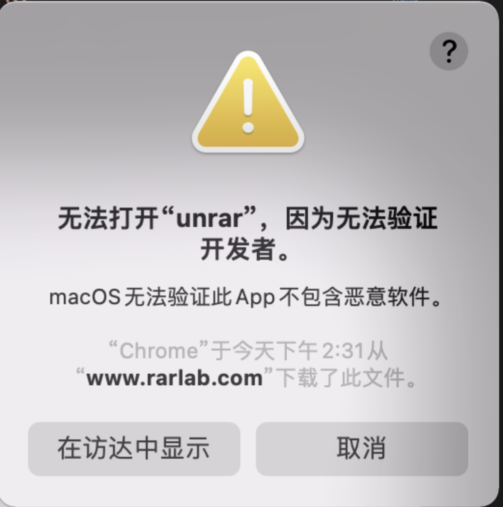

# Mac 相关信息

## 快捷键

- 使用 ifconfig 查看本机 ip

  ```js
  $ ifconfig en0
  // 使用 grep awk 来进行精准获取
  $ ifconfig en0 | grep inet | grep -v inet6 | awk '{print $2}'
  ```

- hosts

  - 文件路径：`/etc/hosts`
  - 查看文件：`cat /etc/hosts`
  - 编辑文件：`sudo vi /etc/hosts` 或者 `code /etc/hosts` 或者 `open /etc/hosts`

- unrar
  - 下载：[https://github.com/ociviol/cbzManager/tree/master/cbzManager/Bin-Mac](https://github.com/ociviol/cbzManager/tree/master/cbzManager/Bin-Mac)
  - 下载之后，需要放在下面的目录中：`/usr/local/bin`
  - 可以用 cp 当前 unrar 文件到目标目录：`cp unrar /usr/local/bin`
  - 如果发现没有权限 那么可能需要手动移动：`cd /usr/local/bin`然后`open .`
  - 使用：`unrar x {name}.rar`
  - 在使用的过程中会出现弹窗：
  - 去到"系统偏好设置–>安全与隐私"，勾上 App Store 和被认可的开发者
